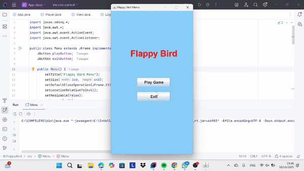

# TP6DPBO2425C2
Saya Fauzia Rahma Nisa mengerjakan Tugas Praktikum 6 dalam mata kuliah Desain dan Pemrograman Berdasarkan Objek untuk keberkahanNya maka saya tidak melakukan kecurangan seperti yang telah dispesifikasikan. Aamiin.

**1. Desain program**

Program Flappy Bird ini dirancang menggunakan paradigma pemrograman berorientasi objek (OOP) dengan pembagian kelas berdasarkan fungsinya masing-masing. Secara keseluruhan, desain program ini membagi tanggung jawab secara terstruktur antara tampilan (Menu, View), logika permainan (Logic), serta objek utama (Player, Pipe). 

- Kelas **Menu** berfungsi sebagai tampilan awal yang menampilkan judul permainan dan dua tombol, yaitu Play Game dan Exit. Saat tombol Play Game ditekan, jendela menu akan ditutup dan kelas App akan dijalankan untuk memulai permainan.

- Kelas **App** bertugas menyiapkan jendela utama permainan. Di dalamnya terdapat objek Logic yang mengatur jalannya permainan serta objek View yang berfungsi menampilkan elemen visual ke layar. Label skor juga dibuat dan dikirim ke Logic agar nilai skor dapat diperbarui saat permainan berlangsung.

- Kelas **Logic** menjadi inti dari program. Di sini terdapat pengaturan pergerakan, gravitasi, kecepatan pipa, serta deteksi tabrakan antara dan pipa. Logic juga bertugas memperbarui skor setiap kali pemain berhasil melewati pipa tanpa menabrak. Kelas ini terhubung langsung dengan View agar perubahan logika dapat langsung tergambar di tampilan.

- Kelas **View** merupakan komponen yang mengatur tampilan grafis permainan. Kelas ini terdapat JPanel dan menampilkan semua elemen seperti latar belakang, burung, serta pipa. Ia juga menangani penggambaran ulang (repaint) dan input dari pemain seperti menekan tombol untuk membuat burung terbang.

- Kelas **Player** merepresentasikan karakter utama, yaitu burung. Di dalamnya ada atribut posisi, kecepatan jatuh (velocity), serta gambar burung. Setiap kali pemain menekan tombol, kelas ini akan mengubah kecepatan agar burung bisa naik sementara gravitasi menariknya ke bawah.

- Kelas **Pipe** digunakan untuk merepresentasikan rintangan berupa pipa yang bergerak dari kanan ke kiri. Setiap objek Pipe menyimpan posisi, ukuran, gambar, serta status apakah pipa sudah dilewati atau belum. Kelas ini membantu pengaturan gerakan pipa dan deteksi skor.

**2. Alur Program**

  Program dimulai dari kelas Menu.java. Saat dijalankan, akan muncul jendela berisi judul dan dua tombol yaitu Play Game dan Exit. Jika pemain menekan tombol Play Game, maka jendela menu ditutup dan game utama dijalankan melalui kelas App. Di dalam kelas ini dibuat jendela permainan berukuran 360x640 piksel, label skor, serta dua objek penting yaitu Logic dan View yang saling terhubung.

  Setelah game dimulai, kelas Logic.java mengatur seluruh jalannya permainan menggunakan dua buah timer. Timer pertama berfungsi untuk mengupdate posisi objek sekitar 60 kali per detik, sedangkan timer kedua menambahkan pipa baru setiap 1,5 detik. Saat pemain menekan tombol spasi, burung akan melompat ke atas, dan jika tidak, gravitasi akan menariknya turun. Pipa-pipa bergerak ke kiri secara terus-menerus dan pemain harus menjaga agar burung tidak menabrak.

  Ketika burung berhasil melewati pipa bawah, skor akan +1 dan label skor diperbarui secara otomatis. Namun, jika burung menabrak pipa atau jatuh ke bawah layar, permainan berakhir dan status gameOver akan menjadi benar. Pada saat itu, layar menampilkan tulisan “GAME OVER” serta instruksi untuk menekan tombol R agar dapat memulai ulang permainan. Saat tombol tersebut ditekan, game di-reset: posisi burung kembali ke awal, skor diatur ulang ke nol, dan semua pipa dihapus dari layar.

**3. Dokumentasi saat program dijalankan**

